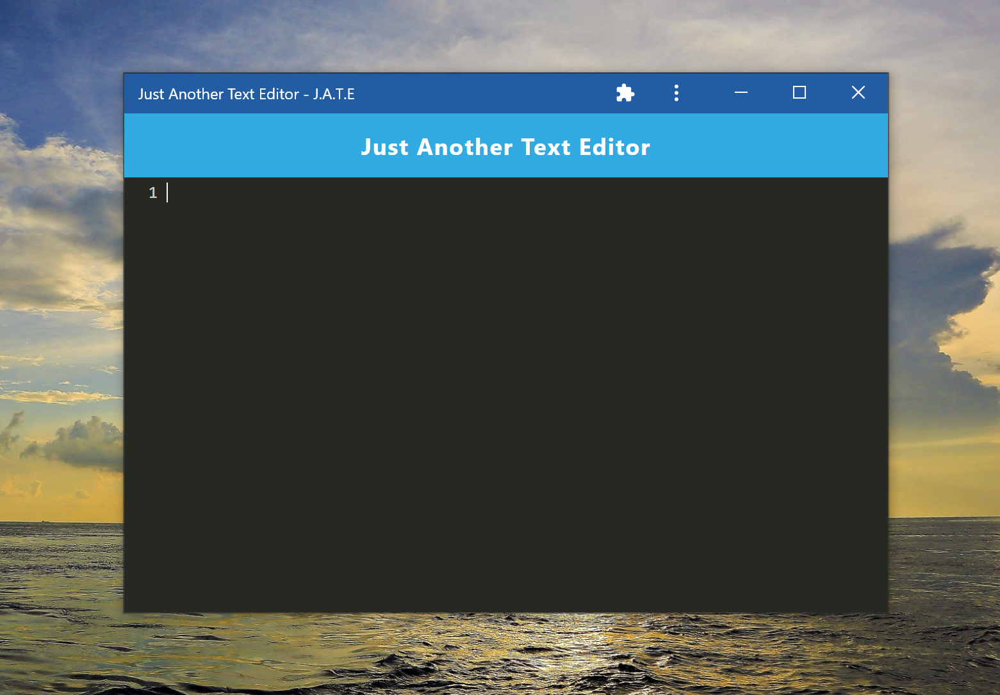

# upgraded-bassoon

## Description

upgraded bassoon is an web app code editor that stores your code on the client side (using indexedDb, manifest, cache storage and service workers). You can also install it on your pc or mobile. It works offline too!

## Links

[Deployed application](https://damp-sands-59987.herokuapp.com/)

[Git repository](https://github.com/AbdalehHersi/upgraded-bassoon)

## Screenshots

